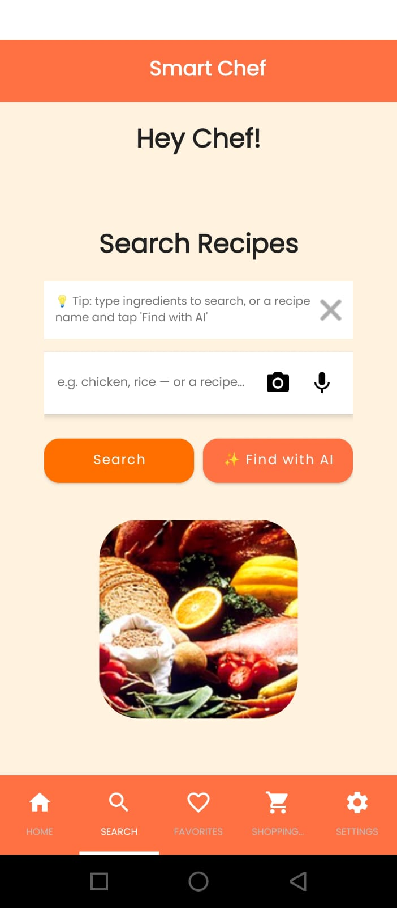
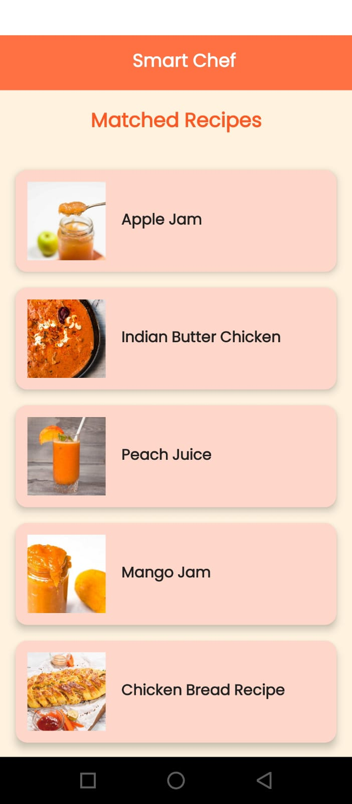
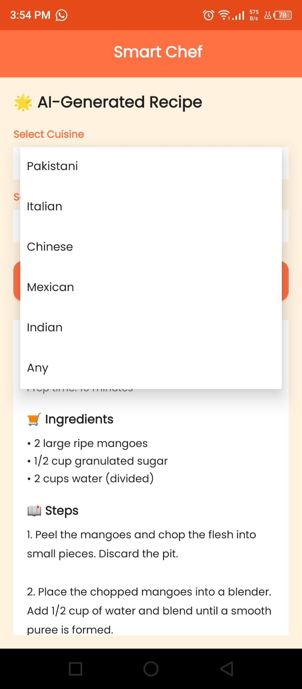
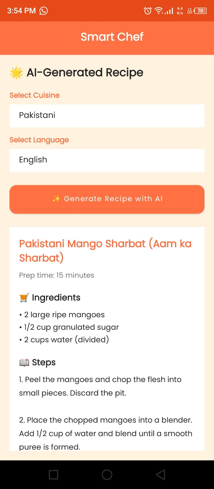
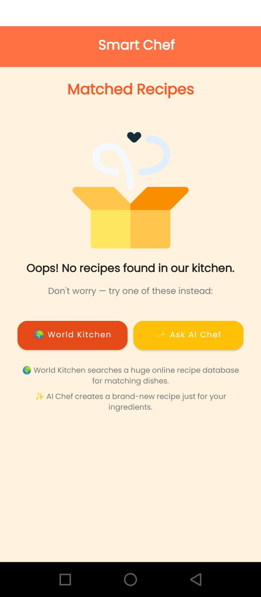
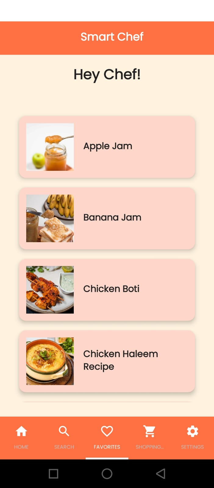
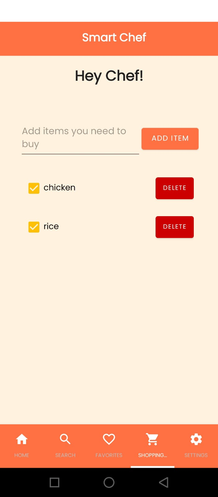
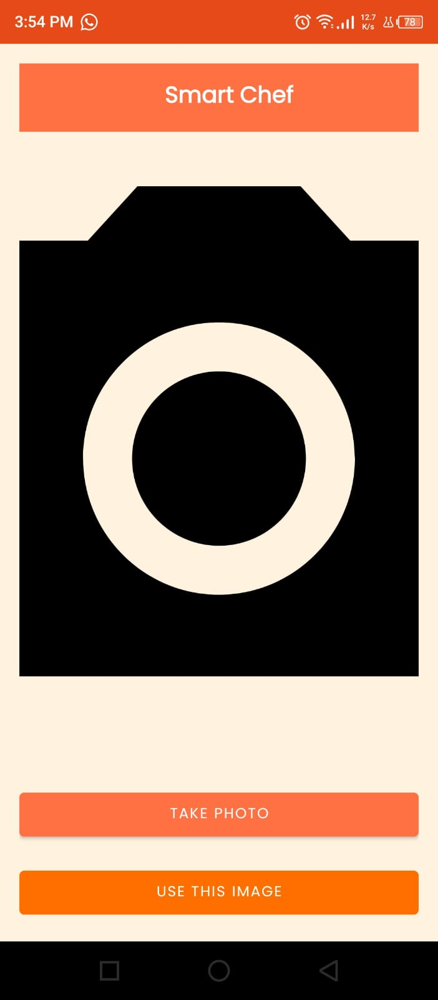
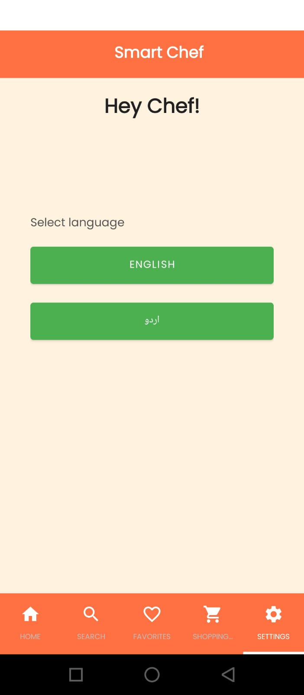
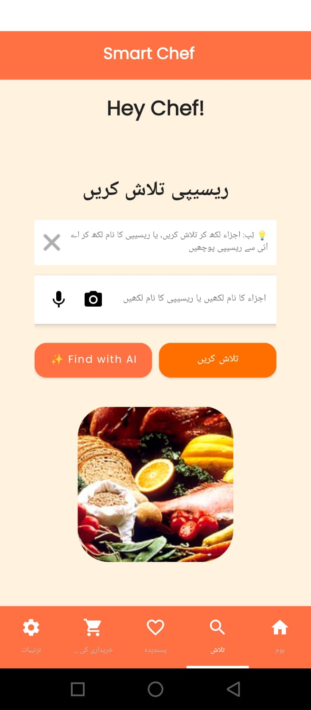

# 🍳 Smart Chef

An Android app that helps you figure out what to cook with the ingredients you already have — search a recipe database by ingredients, or let AI generate a brand-new recipe on the spot. Supports English and Urdu.

## 📸 Screenshots

| | | |
|---|---|---|
| **Home Screen** | **Search Ingredients** | **Matched Recipes** |
|  |  |  |
| **AI Setup** | **AI Generated Recipe** | **Spoonacular Fallback** |
|  |  |  |
| **Favorites** | **Shopping List** | **Camera Ingredient Scanner** |
|  |  |  |
| **Settings (Language Toggle)** | **App UI in Urdu** | |
|  |  | |

## ✨ Features

- **Ingredient-based search** — type up to 10 ingredients (or scan/speak them) and find matching recipes
- **AI-generated recipes** — powered by Gemini via Firebase AI Logic; describe what you have, choose a cuisine and language, and get a full recipe with title, ingredients, and step-by-step instructions
- **Camera ingredient scanning** — snap a photo of ingredients and extract text via on-device ML Kit OCR
- **Voice input** — speak your ingredients instead of typing
- **Bilingual UI** — full English and Urdu support, switchable from Settings
- **Favorites** — save recipes locally with Room database
- **Shopping list** — track items you need to buy
- **Recipe ratings** — rate recipes, stored in Firestore
- **External recipe fallback** — when no local match is found, search a global recipe API (Spoonacular) or generate one with AI instead

## 📲 Download APK

You can download the latest version of SmartChef APK directly from GitHub:

[](https://github.com/dev-toobakalam/SmartChef/raw/main/apk/SmartChef.apk)

**Direct Link:**
[SmartChef.apk](https://github.com/dev-toobakalam/SmartChef/raw/main/apk/SmartChef.apk)

> Since this APK isn't distributed through the Play Store, your phone will ask for permission to "install from unknown sources" the first time — this is a normal one-time prompt for any app installed outside the Play Store.

## 🛠️ Tech Stack

| Layer | Technology |
|---|---|
| Language | Java |
| UI | Android Views, Material Components, `TabLayout` bottom navigation |
| AI | Firebase AI Logic (Gemini `gemini-2.5-flash`) |
| Database (local) | Room |
| Database (remote) | Firebase Firestore |
| Image loading | Glide |
| OCR | Google ML Kit Text Recognition |
| Networking | OkHttp, Gson |
| External recipe data | Spoonacular API |

## 📱 Screens

- **Dashboard** — animated splash/landing screen
- **Home** — quick-glance welcome screen with a food image and quote
- **Search** — ingredient input with camera/voice shortcuts, plus AI generation entry point
- **Recipe List** — matched recipes ranked by ingredient overlap
- **Recipe Detail** — full recipe view with favoriting and rating
- **Generate with AI** — cuisine + language selection, AI-written recipe with structured Title/Ingredients/Steps sections
- **Favorites** — saved recipes (offline, Room-backed)
- **Shopping List** — simple checklist for groceries
- **Settings** — language toggle (English/Urdu)

## 🚀 Getting Started

### Prerequisites

- Android Studio (latest stable)
- A Firebase project with **AI Logic** (Gemini Developer API) enabled
- A [Spoonacular API key](https://spoonacular.com/food-api) (free tier available)

### Setup

1. Clone the repo:

   ```bash
   git clone https://github.com/dev-toobakalam/SmartChef.git
   ```

2. Add your Firebase config:
   - Create a Firebase project at [console.firebase.google.com](https://console.firebase.google.com)
   - Enable **AI Logic** → Gemini Developer API (no billing required on the free Spark plan)
   - Download `google-services.json` and place it in `app/`

3. Add your Spoonacular key:
   - Create a `local.properties` file in the project root (if it doesn't already exist)
   - Add the following line:
     ```properties
     SPOONACULAR_API_KEY=your_key_here
     ```

4. Open the project in Android Studio, let Gradle sync, and run.

> **Security note:** No API key is shipped inside the compiled app. Gemini access goes through Firebase AI Logic, which is authenticated via `google-services.json` rather than an embedded key, and the Spoonacular key is injected at build time through `BuildConfig` rather than hardcoded into source.

## 🌐 Localization

The app fully supports English and Urdu. Strings live in:

- `res/values/strings.xml` — default (English)
- `res/values-ur/strings.xml` — Urdu

Language can be switched anytime from the **Settings** tab — the app recreates itself immediately to apply the change across every screen, including the bottom navigation tabs.

## 📂 Project Structure

```
SmartChef/
├── app/
│   └── src/main/
│       ├── java/com/mad/smartchef/
│       │   ├── activities/        # Dashboard, Main, RecipeDetail, RecipeList,
│       │   │                      #   GenerateRecipe, SpoonacularDetail, Camera
│       │   ├── Fragments/          # Search, Settings, RecipeList, Favorites,
│       │   │                      #   ShoppingList
│       │   ├── adapter/            # RecyclerView adapters (recipes, etc.)
│       │   ├── models/             # RecipeModel
│       │   ├── data/               # Room entities & DAOs (favorites, shopping list)
│       │   └── utils/              # Locale handling (LocalHelper)
│       └── res/
│           ├── layout/             # Screen & item layouts
│           ├── values/             # Default strings, colors, styles, arrays
│           ├── values-ur/          # Urdu translations
│           ├── menu/                # Bottom navigation menu
│           ├── drawable/           # Icons & vector assets
│           └── font/                # Poppins font family
├── apk/                            # Pre-built APK for direct download
├── Screenshots/                    # README screenshots
├── gradle/
└── build.gradle.kts
```

## 🔮 Possible Future Improvements

- Dish images for AI-generated recipes
- Offline recipe caching
- More cuisines and dietary preference support
- Migrate camera capture to CameraX (currently uses the legacy intent-based camera API)

## 📄 License

This project was built for educational/portfolio purposes.
